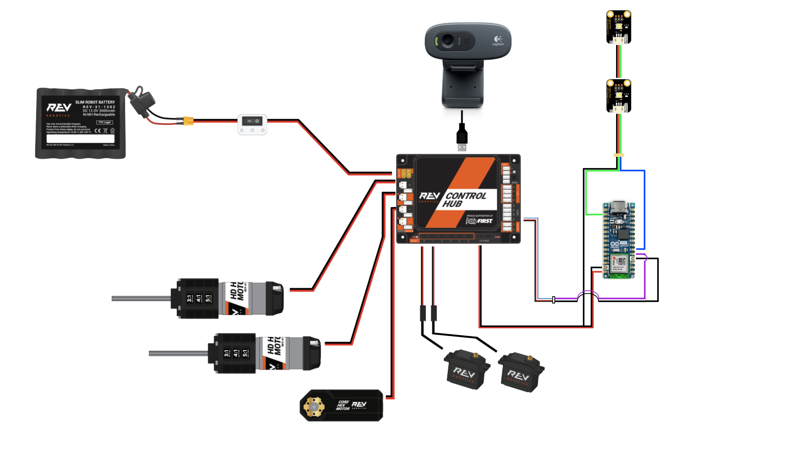

# FTC Color-Sorting Robot with Arduino LED Feedback

An FTC competition robot that uses camera vision, color detection, and AprilTags to sort objects into the correct containers — with LED-based visual feedback powered by Arduino.

---

## Table of Contents

- [Overview](#-overview)
- [Hardware Components](#️-hardware-components)
- [Wiring Diagram](#-wiring-diagram)
- [Software & Technologies](#-software--technologies)
- [Features & Workflow](#-features--workflow)
- [Gamepad Controls](#-gamepad-controls)
- [Code Structure](#️-code-structure)
- [Installation & Setup](#-installation--setup)
- [Future Enhancements](#️-future-enhancements)
- [Credits & License](#-credits--license)

---

## Overview

This robot can detect the dominant color of an object, recognize the nearest container via AprilTags, and determine if the object was placed correctly based on predefined color sets. Feedback is shown using WS2812 RGB LEDs controlled by an Arduino Nano ESP32.

It’s designed for:

- FTC teams
- Educational robotics
- Vision-based object sorting systems

---

## Hardware Components

| Component               | Port / Connection         | Function                      |
|------------------------|---------------------------|-------------------------------|
| HD Hex Motor (Right)   | REV port 0                | Right drivetrain              |
| HD Hex Motor (Left)    | REV port 1                | Left drivetrain               |
| Core Hex Motor (Lift)  | REV port 2                | Lift mechanism                |
| Servo (CatchL)         | REV servo port 0          | Left claw                     |
| Servo (CatchR)         | REV servo port 1          | Right claw                    |
| Logitech C270 Webcam   | USB on Control Hub        | Color + AprilTag detection    |
| Arduino Nano ESP32     | Digital input from REV    | Controls WS2812 RGB LEDs      |
| WS2812 LED Strip       | Arduino digital pin 6     | Visual result (Green / Red)   |

---

## Wiring Diagram

> *(Insert your image here)*



---

## Software & Technologies

- **FTC SDK** (Java)
- **VisionPortal** with:
  - `PredominantColorProcessor` for color detection
  - `AprilTagProcessor` for identifying containers
- **Arduino IDE (C++)** with `Adafruit_NeoPixel`
- **Digital signaling** between Control Hub and Arduino

---

## AprilTag Configuration

The robot uses **AprilTags** to identify which container an object should be placed into:

| AprilTag ID | Container Meaning | Accepted Colors                         |
|-------------|-------------------|-----------------------------------------|
| `1`         | RED Container     | ORANGE, YELLOW                          |
| `2`         | GREEN Container   | GREEN, CYAN, BLUE                       |
| `3`         | DARK Container    | PURPLE, RED                             |

AprilTags should be printed using [AprilTag Generator](https://github.com/AprilRobotics/apriltag-imgs) and attached near each container. The robot detects them via webcam and aligns object-color logic accordingly.

---

## Demo Video

Check out the full system in action!  
[**Watch the demo on YouTube**](https://youtu.be/Jk_KPpgsRLk)

---

## Features & Workflow

1. Robot moves via gamepad
2. Webcam detects dominant object color
3. AprilTag scanner identifies container type (ID 1–3)
4. Color-object matching is evaluated
5. Arduino-based LED gives immediate feedback:
   - **Green** → correct container
   - **Red** → incorrect container

---

## Gamepad Controls

| Control         | Function                  |
|----------------|---------------------------|
| Left/Right Sticks | Drive movement           |
| D-pad Up/Down  | Raise/lower lift mechanism |
| Right Trigger  | Close claws and hold object |
| Button A       | Display telemetry           |

---

## Code Structure

```
├── src/
│   └── alphaBot_OpMode_v02.java     # FTC TeleOp program
├── Arduino/
│   └── led_control.ino                 # LED control for WS2812
├── images/
│   ├── wiring_diagram.png              # Wiring diagram
└── README.md
```

---

## Installation & Setup

1. **Upload** `led_control.ino` to your **Arduino Nano ESP32** using the [Arduino IDE](https://www.arduino.cc/en/software).
2. **Connect** the digital output pin from the **REV Control Hub** to Arduino pin **D2** (configured as INPUT).
3. **Deploy** the FTC Java program `alphaBot_OpMode_v02` to your Control Hub via Android Studio or OnBot Java.
4. **Start TeleOp mode** from the **FTC Driver Station**.
5. **Watch the LEDs** respond during object placement:
   - Green = correct placement
   - Red = incorrect placement

---

## Future Enhancements

- Advanced LED feedback (e.g., blinking, rainbow effects, fading)
- Fully **autonomous sorting mode** (no driver input)
- Integration of **LiDAR** for precise distance measurement
- **Simultaneous multi-object tracking** using higher resolution vision
- Web-based dashboard for remote telemetry

---

## Credits & License
Made with by **Martin Hronský** & **Adam Kukla**  
as part of the **FIRST Global Slovakia**, Slovak NGO.

### Technologies Used

- [FTC SDK](https://github.com/FIRST-Tech-Challenge/FtcRobotController) — for robot hardware control  
- OpenCV-powered **VisionPortal** — color & AprilTag processing  
- [Adafruit NeoPixel Library](https://github.com/adafruit/Adafruit_NeoPixel) — LED control via Arduino

---

### License

This project is licensed under the **MIT License** © 2025  
Feel free to use, modify, and share with attribution!